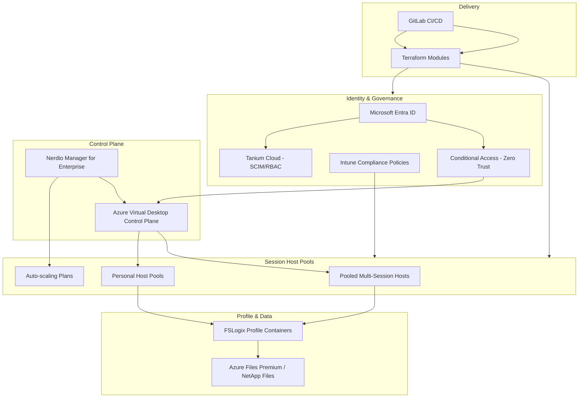

# Azure AVD Enterprise Architecture

**Infrastructure-as-Code reference architecture for enterprise Azure Virtual Desktop platforms** — covering compute, profile management, identity governance, and endpoint security, designed the way a Fortune-500 insurance/financial services environment actually runs one.

Built and maintained by a Senior Cloud & Infrastructure Engineer with 16+ years of enterprise Azure, AVD, and identity architecture experience.

---

## Why this repo exists

Most public AVD samples show a single host pool spun up in isolation. Production AVD platforms are never that simple — they're a stack of interdependent decisions: identity governance, session host lifecycle, profile storage performance, endpoint compliance, and cost control, all wired together and shipped through a CI/CD pipeline with approvals and drift detection.

This repo is a portfolio-grade, sanitized reference architecture that mirrors that reality.

---

## Architecture at a glance



Full diagram breakdown and design rationale: [`docs/architecture-overview.md`](docs/architecture-overview.md)

---

## Repository structure

```
azure-avd-enterprise-architecture/
├── terraform/
│   ├── avd-host-pool/            # Host pool, workspace, application group provisioning
│   ├── nerdio-manager/           # NME control plane deployment
│   ├── entra-conditional-access/ # Zero Trust CA policies scoped to AVD
│   └── modules/
│       └── fslogix-storage/      # Azure Files Premium + FSLogix profile container module
├── tanium-scim/                  # Entra ID → Tanium Cloud SCIM provisioning & RBAC mapping
├── docs/
│   └── architecture-overview.md  # Design decisions, diagrams, trade-offs
└── .gitlab-ci.yml                # Plan/apply pipeline with manual production gate
```

---

## Design principles applied throughout

1. **AVD as the Zero Trust perimeter** — Conditional Access treats the AVD session, not the endpoint, as the trust boundary for contractor and BYOD access.
2. **Everything provisioned through code** — host pools, scaling plans, and CA policies are Terraform-managed; no console-driven drift.
3. **Identity-first endpoint security** — Tanium Cloud RBAC roles are mapped and provisioned automatically via Entra ID SCIM, not managed by hand.
4. **Profile performance is a first-class concern** — FSLogix container sizing and Azure Files tier selection are treated as capacity-planning decisions, not defaults.
5. **CI/CD with a human gate** — `terraform plan` runs automatically; `apply` to production requires manual approval in the pipeline.

---

## Tech stack

`Terraform` · `Azure Virtual Desktop` · `Nerdio Manager for Enterprise` · `FSLogix` · `Microsoft Entra ID` · `Conditional Access` · `Intune` · `Tanium Cloud` · `GitLab CI/CD` · `PowerShell`

---

## About

Maintained as a portfolio reference architecture. Resource names, tenant IDs, and identifiers throughout are illustrative — this is a design and automation reference, not a deploy-as-is template for a specific tenant.

Connect: [LinkedIn](https://www.linkedin.com/in/ramnarendra-naidu-gadi-sri-venkata-b1608190)
