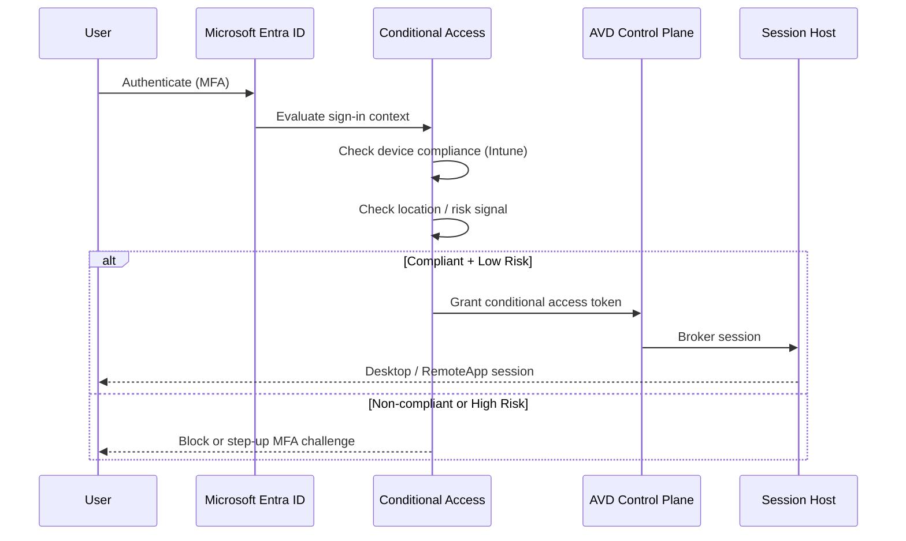
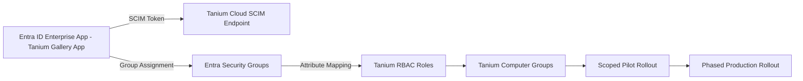
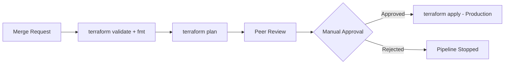

# Architecture Overview

## 1. Identity governance flow

Every session host boot and every user logon is gated by Conditional Access. Contractors and unmanaged devices never receive a network-level trust; the AVD session itself is the enforced boundary.

## 2. Endpoint security provisioning (Tanium Cloud via SCIM)

**Key design decisions:**
- Entra security groups are the single source of truth for Tanium RBAC role assignment — no manual role grants in Tanium Cloud.
- SCIM attribute mapping translates Entra group membership directly into Tanium Computer Group scope, keeping endpoint visibility aligned with org structure.
- Pilot rollout is scoped to a single Entra security group before phased expansion, so provisioning logic is validated before it touches the full fleet.

## 3. Host pool capacity model

| Host Pool Type | Use Case | Scaling Strategy |
|---|---|---|
| Pooled Multi-Session | Task workers, call center | Nerdio auto-scale, business-hours ramp |
| Personal (Static) | Developers, power users | Start-on-connect, no auto-deallocate |
| Pooled Multi-Session (GPU) | CAD / engineering | Scheduled scale-up, manual scale-down |

## 4. Profile storage trade-offs

- **Azure Files Premium** is the default for FSLogix profile containers — predictable IOPS, native AD/Entra Kerberos auth, lower operational overhead than a dedicated file server.
- **Azure NetApp Files** is used only where sub-millisecond latency is required (large profile sizes, GPU workstation pools).
- Profile containers are capped and monitored; oversized profiles are flagged rather than silently tolerated, since profile bloat is the most common driver of AVD logon-time complaints in production.

## 5. CI/CD pipeline gate

Production `apply` is never automatic. Plan output is attached to the merge request for reviewer visibility before the manual gate is triggered.
